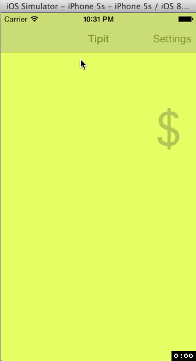

Tipit (Tip Calculator)  
==================

Pre-bootcamp project, with all the optionals completed,

 - Remember the bill amount across app restarts. After an extended period of time, clear the state. This is a UI trick that Apple uses with the Spotlight app. If you return there a minute later, it will show your most recent search. if you return 10 minutes later, it defaults to blank. To implement this, plug into the application lifecycle and track time using NSDate. [DONE]
 - Use locale specific currency and currency thousands separators. [DONE]
 - Add a light/dark color theme to the settings view. In viewWillAppear, update views with the correct theme colors. [DONE]
 - Added Animations and formatting to improve the user experience. [DONE]

Walkthrough of Tipit:    

GIF created with [LiceCap](http://www.cockos.com/licecap/).
